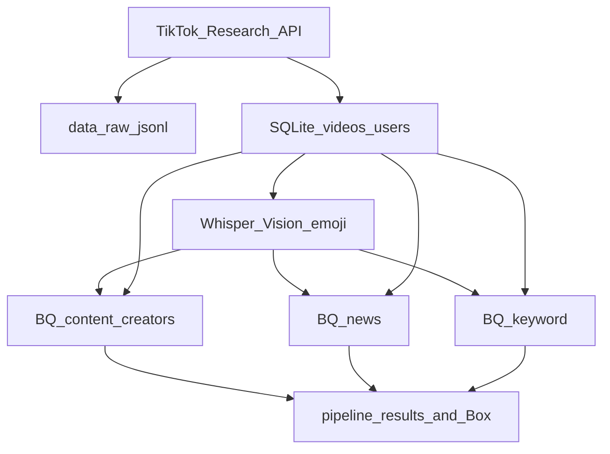

# Data schema and column reference

Canonical reference for every dataset, table, and column in the TikTok research
pipelines. Active tables: **`content_creators`**, **`news`**, **`keyword`**.

If a column name here disagrees with a script, **this document plus
[`common/enrichment/bigquery_loader.py`](../common/enrichment/bigquery_loader.py)
(`BQ_SCHEMAS`, `RESEARCH_COLUMNS`, `OPERATIONAL_COLUMNS`) are the source of truth.**

---

## 1. Where data lives

| Layer | Location | Role |
|-------|----------|------|
| Raw JSONL | `data/raw/{videos,users}/` (server, gitignored) | Verbatim API responses |
| SQLite | `data/tiktok_research.db` (server) | Collection + enrichment **staging** |
| BigQuery | `cfme-mediaengagment-prod.tiktok_research` | **Analytics source of truth** |
| P1/P2/P3 exports | `p1_content_creators/results/` · `p2_news/results/` · `p3_keywords/results/` | CSV / summaries |
| Box copies | `p1_content_creators/box/` · `p2_news/box/` · `p3_keywords/box/` | Daily `YYYY-MM-DD.csv` |

> The laptop copy of `data/tiktok_research.db` (if present) holds **collection
> tables only**; enrichment staging tables exist on the server. Do not treat
> local row counts as enrichment coverage.

---

## 2. Source-of-truth rules (read this first)

Several fields have more than one historical home. For production/analytics,
use **only** the columns marked SoT below.

| Concept | Production SoT | Non-production / legacy (do not use for analytics) |
|---------|----------------|----------------------------------------------------|
| Transcript | BQ `whisper_transcript` (from SQLite `video_transcripts.transcript`) | SQLite `transcripts` table + `videos.transcript` (API `voice_to_text` / old ASR) |
| On-screen text (OCR) | BQ `ocr_text` (cleaned, from SQLite `video_ocr`) | SQLite `videos.onscreen_text` / `visual_text_*` (EasyOCR path) |
| Emoji | BQ `emoji_characters` / `emoji_descriptions` / `emoji_category` | — |
| Saves metric | BQ `favorite_count` | SQLite `save_count`, API `favorites_count` (same value, different names) |
| Creator handle | BQ `creator_username` | SQLite `username`, export CSV `handle`, legacy `creator_handle` |
| Research export | per-pipeline `results/` + Box CSV | archived `archive/v5/scripts/export_research_dataset.py` (`tiktok_video_enriched`) |

---

## 3. SQLite tables

Defined in [`common/tiktok/db.py`](../common/tiktok/db.py) (collection) and
[`common/enrichment/store.py`](../common/enrichment/store.py) (enrichment staging).

### Collection tables (`common/tiktok/db.py`)

| Table | PK | Purpose |
|-------|-----|---------|
| `videos` | `video_id` | Collected videos + classification + legacy visual-text columns |
| `users` | `username` | Creator profiles + account-type classification |
| `comments` | `comment_id` | Comment rows (**currently empty — not collected in v5.0**) |
| `raw_responses` | `id` | API request/response archive (audit trail) |
| `transcripts` | `video_id` | **Legacy** ASR output (`scripts/transcribe_videos.py`) |

**`videos` columns:** `video_id`, `username`, `video_url`, `create_time`,
`posted_at`, `caption`, `hashtags`, `like_count`, `share_count`, `comment_count`,
`save_count`, `duration_seconds`, `voice_to_text`, `transcript`,
`transcript_source`, `transcript_failure_reason`, `text_for_nlp`, `news`,
`politics`, `news_and_politics`, `model_version`, `processing_timestamp`,
`inserted_at`, `onscreen_text`, `onscreen_ocr_meta`, `sticker_overlay_text`,
`sticker_info_list`, `browser_ocr_text`, `visual_text_combined`,
`visual_text_source_priority`.

> `onscreen_text`, `browser_ocr_text`, `visual_text_*`, `news`, `politics`,
> `text_for_nlp` are **research-local** — they are **not** synced to BigQuery.

**`users` columns:** `username`, `display_name`, `bio`, `is_verified`,
`follower_count`, `following_count`, `likes_count`, `video_count`, `api_failed`,
`account_type_code`, `account_type_label`, `model_version`,
`processing_timestamp`, `inserted_at`.

**`comments` columns:** `comment_id`, `video_id`, `video_url`, `video_username`,
`commenter_handle`, `text`, `like_count`, `create_time`, `posted_at`,
`parent_comment_id`, `reply_count`, `inserted_at`.

**`raw_responses` columns:** `id`, `endpoint`, `request_params`,
`response_body`, `username`, `http_status`, `captured_at`.

**`transcripts` (legacy) columns:** `video_id`, `transcript_text`, `language`,
`transcript_source`, `model_name`, `audio_path`, `duration_seconds`,
`processing_timestamp`.

### Enrichment staging tables (`common/enrichment/store.py`)

These live on the server and feed the BigQuery upsert.

| Table | PK | Purpose |
|-------|-----|---------|
| `video_transcripts` | `video_id` | Whisper transcript staging → BQ `whisper_transcript` |
| `video_ocr` | `id` | Per-frame Vision OCR staging → BQ `ocr_text` |
| `video_ocr_stats` | `video_id` | Per-video OCR rollup metrics |
| `video_emojis` | `id` | Emoji rows → BQ emoji fields |
| `enrichment_log` | `id` | Worker timing/errors → BQ `tiktok_pipeline_logs` |
| `enrichment_pipeline_status` | `video_id` | Per-stage completion timestamps |

> Note: the SQLite staging tables `video_transcripts` / `video_ocr` /
> `video_emojis` share names with **deprecated** BigQuery tables. In BigQuery
> those names must never be written (see section 4).

---

## 4. BigQuery objects

Project `cfme-mediaengagment-prod`, dataset `tiktok_research`. Schemas defined in
[`common/enrichment/bigquery_loader.py`](../common/enrichment/bigquery_loader.py)
(`BQ_SCHEMAS`).

### Shared research columns (P1 / P2 / P3)

The three pipeline tables share this research column set (`RESEARCH_COLUMNS`).
The archived v5 table `tiktok_video_enriched` used the same names; it is **not**
an active destination.

**Research columns (`RESEARCH_COLUMNS`):**

| Column | Type | Meaning |
|--------|------|---------|
| `video_id` | STRING | TikTok video id (logical PK) |
| `video_url` | STRING | Canonical watch URL |
| `creator_username` | STRING | Handle without `@` |
| `creator_display_name` | STRING | Profile display name |
| `creator_bio` | STRING | Profile bio |
| `creator_verified` | BOOL | Verified badge |
| `creator_followers` | INT | Follower count |
| `creator_following` | INT | Following count |
| `creator_total_likes` | INT | Lifetime account likes |
| `creator_video_count` | INT | Account video count |
| `posted_at` | STRING | Publish time (UTC string) |
| `caption` | STRING | Post caption / description |
| `hashtags` | STRING | Hashtag string |
| `like_count` | INT | Likes |
| `comment_count` | INT | Comments |
| `share_count` | INT | Shares |
| `favorite_count` | INT | Saves / favorites |
| `video_duration_seconds` | FLOAT | Duration |
| `voice_to_text` | STRING | TikTok API ASR / voice-to-text when present |
| `sticker_text` | STRING | Sticker / overlay text from API metadata |
| `comments_json` | STRING | JSON array of comment objects (empty until comments are collected) |
| `whisper_transcript` | STRING | Whisper ASR transcript (enrichment) |
| `ocr_text` | STRING | **Primary research OCR** (cleaned) |
| `emoji_characters` | STRING | Pipe-joined emoji glyphs |
| `emoji_descriptions` | STRING | CLDR / research names |
| `emoji_category` | STRING | Semantic categories |

**Operational columns (`OPERATIONAL_COLUMNS`):**

| Column | Type | Meaning |
|--------|------|---------|
| `whisper_status` | STRING | `ok` / `failed` / `missing` (never `ok` with empty transcript) |
| `whisper_latency_seconds` | FLOAT | Worker latency |
| `raw_ocr_text` | STRING | Full Vision text before filtering |
| `cleaned_ocr_text` | STRING | Deduped / filtered OCR (mirrors `ocr_text`) |
| `ocr_quality_score` | FLOAT | 0–100 OCR cleanliness (meaningful OCR gate: `>= 25`) |
| `ocr_character_count` | INT | Length of cleaned OCR |
| `ocr_unique_text_ratio` | FLOAT | Unique-block ratio after dedupe |
| `ocr_source_count` | INT | Distinct OCR source labels |
| `emoji_source` | STRING | Text layers where emojis were found |
| `enrichment_status` | STRING | `ok` / `partial` / `failed` |
| `enrichment_quality_score` | FLOAT | Modality coverage 0–100 |
| `failure_reason` | STRING | Active failure summary (empty when healthy) |
| `enrichment_date` | STRING | UTC date of last enrichment write (`YYYY-MM-DD`) |
| `pipeline_version` | STRING | `enrichment-v5.0` |

### `tiktok_pipeline_logs` — append-only ops log

`log_id`, `video_id`, `stage`, `status`, `retry_count`, `pipeline_version`,
`start_time`, `end_time`, `duration_seconds`, `error_type`, `error_message`,
`worker_hostname`, `created_at`.

`tiktok_pipeline_logs` also stores optional `pipeline_id` and `collection_source`
(additive columns; v5.0 rows may leave them empty).

### `content_creators` — Pipeline 1 research table

Created by `ensure_content_creators_table()`. Does **not** replace
`tiktok_video_enriched`. Identity is `video_id`. Upsert via
`sync_content_creator_video`.

Provenance: `collection_source=content_creators`, `pipeline_id=content_creators`,
`api_source=CONTENT_CREATOR_API`, `collection_date` (America/Chicago civil date),
`collection_window_start` / `collection_window_end` (UTC).

`collection_status` is `ok` for collected videos and `api_failed` for handles
whose `video/query` exhausted retries (HTTP 500 `internal_error`, etc.). Failed
handles use a synthetic `video_id` `handle_fail:{YYYY-MM-DD}:{handle}` so they
can be upserted without a TikTok video. Video analyses should filter
`collection_status = 'ok'` (or `STARTS_WITH(video_id, 'handle_fail:') = FALSE`).
`api_error_code` stores the Research API error code on failure rows (blank on
video rows). Daily Box CSVs and the P1/P2 copy-paste pulls in
[`p1_content_creators/sql/content_creators.sql`](../p1_content_creators/sql/content_creators.sql) include both
row types, with failure stubs listed first and status columns on the left.

Field names follow the three-pipeline schema (`likes`, `verified_status`,
`ocr_status`, `emoji_count`, …). See `BQ_SCHEMAS["content_creators"]`.

### `news` — Pipeline 2 research table

Created by `ensure_news_table()`. Same core fields as
`content_creators`. Identity is `video_id`. Upsert via
`sync_news_account_video`. Does **not** write Pipeline 2 rows to
`tiktok_video_enriched` or `content_creators`.

Provenance: `collection_source=news`, `pipeline_id=news`,
`api_source=NEWS_API`.

Handle list: `p2_news/config/news_accounts.txt` (137 unique from
Institutional Handles 08252026.xlsx).

### `keyword` — Pipeline 3 research table

Created by `ensure_keyword_table()`. Same core fields as
`content_creators`, plus `matched_keywords` (`ARRAY<STRING>`: every
keyword that matched this `video_id`). Identity is `video_id`. Upsert via
`sync_keyword_search_video`. Does **not** write Pipeline 3 rows to
`tiktok_video_enriched`, `content_creators`, or `news`.

Provenance: `collection_source=keyword`, `pipeline_id=keyword`,
`api_source=KEYWORD_SEARCH_API`.

Canonical keywords: `p3_keywords/config/march_news_keywords.txt` (263 terms).
Sample: `news`, `trump`, `tsa`, `ice`, `netanyahu`.

### Monitoring views

Defined in [`archive/v5/sql/monitoring_dashboard.sql`](../archive/v5/sql/monitoring_dashboard.sql):
`v_enrichment_daily`, `v_enrichment_today`, `v_enrichment_failures`,
`v_enrichment_quality`, `v_enrichment_duplicates`.

### Non-analytics / do-not-use

- **Backup tables** `tiktok_video_enriched_backup_YYYYMMDD_HHMMSS` — created by
  `archive/v5/scripts/rebuild_tiktok_video_enriched.py`; rebuild artifacts, not sources.
- **Deprecated tables** `videos_raw`, `video_transcripts`, `video_ocr`,
  `video_emojis` (`LEGACY_BQ_TABLES`) — never written; drop via
  [`archive/v5/sql/drop_legacy_bq_tables.sql`](../archive/v5/sql/drop_legacy_bq_tables.sql).

---

## 5. Cross-layer naming map (API → SQLite → BigQuery)

The same concept is sometimes named differently at each layer. This is the
authoritative rename map.

| Concept | TikTok API | SQLite | BigQuery |
|---------|------------|--------|----------|
| Video id | `id` | `video_id` | `video_id` |
| Creator handle | `username` | `username` | `creator_username` |
| Caption | `video_description` | `caption` | `caption` |
| Saves | `favorites_count` | `save_count` | `favorite_count` |
| Duration | `video_duration` | `duration_seconds` | `video_duration_seconds` |
| Sticker text | `sticker_info_list` (names) | `sticker_overlay_text` | `sticker_text` |
| Creator bio | `bio_description` | `bio` | `creator_bio` |
| Whisper transcript | — | `video_transcripts.transcript` | `whisper_transcript` |
| Cleaned OCR | — | `video_ocr` (aggregated) | `ocr_text` |
| Comment body | `text` | `comments.text` | `comments_json[].comment_text` |

### Ambiguous names to watch

- **`transcript`** appears in three places with different meanings: API
  `voice_to_text` copied into `videos.transcript`; legacy ASR in
  `transcripts.transcript_text`; enrichment Whisper in
  `video_transcripts.transcript`. Only the last reaches BQ as
  `whisper_transcript`.
- **`ocr_text`** is the SQLite frame working text *and* the BQ cleaned research
  column. `raw_ocr_text` / `cleaned_ocr_text` are the raw/cleaned pair; `ocr_text`
  equals cleaned.
- **saves metric** has three names (`favorites_count` / `save_count` /
  `favorite_count`) for one value.

---

## 6. Export column contract

Two export paths exist; they are intentionally different:

| Export | Source | Columns |
|--------|--------|---------|
| P1/P2/P3 Box + `results/` CSV | Pipeline BigQuery table | Full table fields (status columns first) |
| `archive/v5/scripts/export_research_dataset.py` | archived `tiktok_video_enriched` | Research subset |

The archived exporter intentionally omits `comments_json` (empty until comments
are collected) and ops latency/retry fields. Active pipelines export via Box
delivery (`common/tiktok/box_delivery.py`) and copy-paste SQL in each pipeline
`sql/` folder.

---

## 7. Known gaps / caveats

- `comments` is empty → BQ `comments_json` is always `[]`. Populate SQLite
  `comments` before treating it as a research deliverable.
- `video_ocr` (Vision) is the only OCR path that reaches BQ. The EasyOCR path
  (`archive/evaluation/`, writing `videos.onscreen_text`) is
  research-local and does not populate `ocr_text`.
- `_ensure_table` only **adds** missing BQ columns; it never drops extras.
- Do **not** re-run the `create_time` ← `posted_at` alias backfill in
  `archive/v5/scripts/migrate_bq_simplified_architecture.py`; `create_time` is not in the
  current BQ schema.
